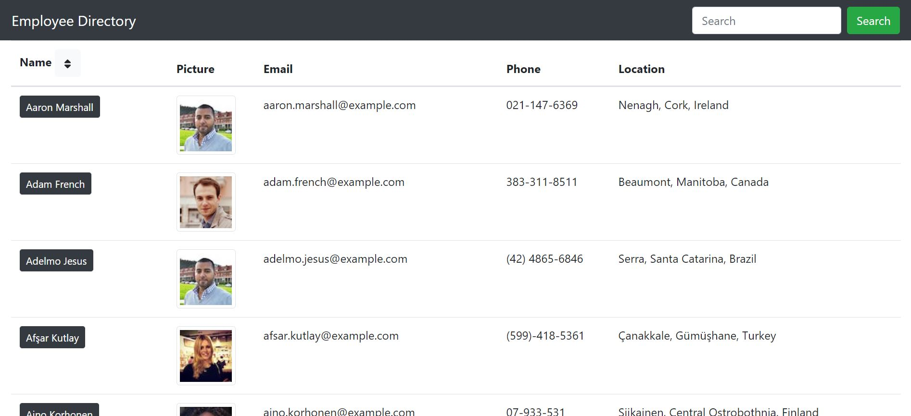
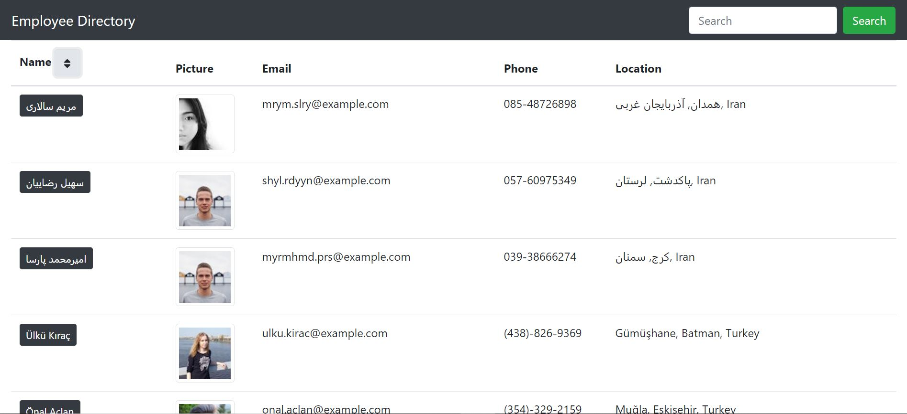
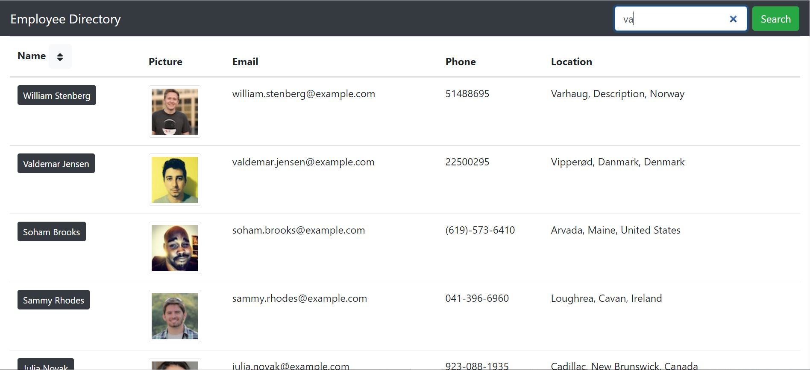

# Employee Directory

## Overview

An online employee directory that retrieves employee's information.

## Usage

To use this app, copy the link below to a browser:

https://linhgt.github.io/employee-directory/

## How it works

When open the app, 100 random employees are retrieved and displayed on the browser. The list can be sorted in ascending order or descending order

When type in a key word in the search bar, users that has any information containing the key word is retrieved

## Issue

Currently there is no issue

## License

MIT

## Technologies

